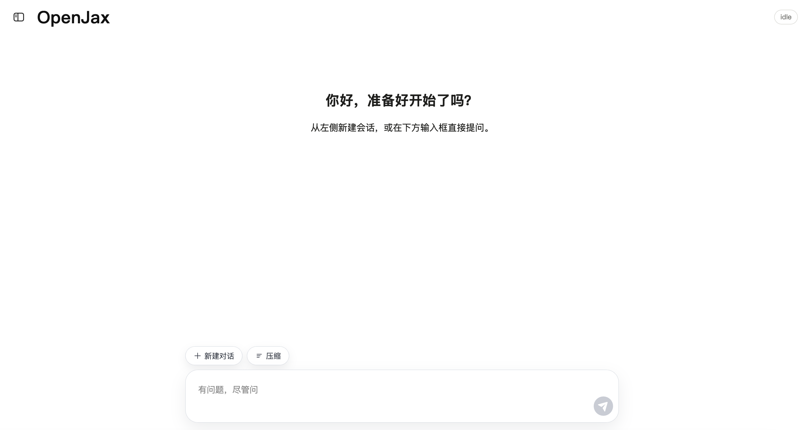
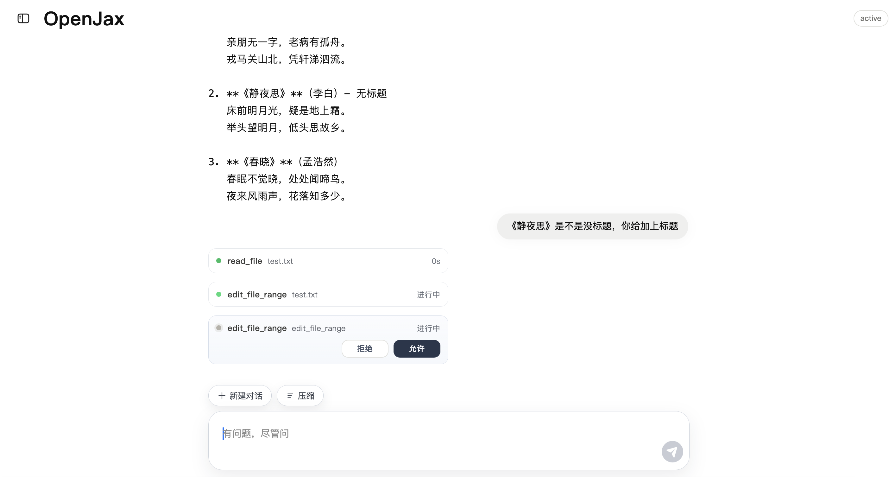
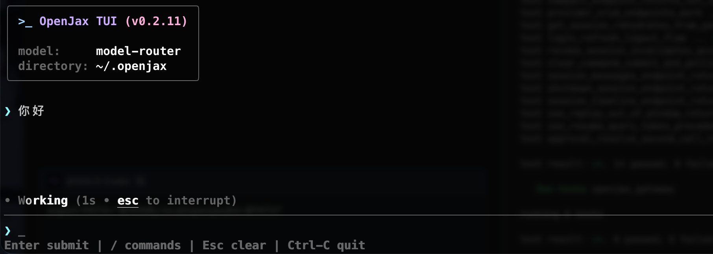

# OpenJax

<p align="center">
  <strong>A safety-first, Rust-native AI assistant runtime for real-world automation.</strong><br/>
  Built for controllable tool execution with sandbox isolation, strict approvals, and low-friction deployment.
</p>

<p align="center">
  <a href="https://github.com/Jaxton07/OpenJax"></a>
  <a href="https://github.com/Jaxton07/OpenJax/blob/main/LICENSE"></a>
  <a href="https://github.com/Jaxton07/OpenJax/commits/main"></a>
  <a href="https://github.com/Jaxton07/OpenJax/stargazers"></a>
</p>

<p align="center">
  <a href="README.md">English</a> |
  <a href="README.zh-CN.md">简体中文</a>
</p>

<p align="center">
  <a href="OVERVIEW.md">Overview</a> |
  <a href="CONTRIBUTING.md">Contributing</a> |
  <a href="SECURITY.md">Security</a> |
  <a href="docs/deployment.md">Deployment</a>
</p>

## Why OpenJax

- Safer sandbox boundaries reduce risky file-system and environment side effects
- Stricter approval gates prevent high-impact actions from running silently
- Rust-first prebuilt delivery keeps environment requirements low and avoids heavy dependency setup
- Claude Code/OpenClaw-style `SKILL.md` compatibility (public subset), so existing skills can be reused with minimal migration
- Clear gateway/daemon/core boundaries improve auditability and operational control

OpenJax prioritizes secure, controllable, and lightweight automation, not just aggressive autonomy.

## Contents

- [Highlights](#highlights)
- [Why OpenJax](#why-openjax)
- [Quick Start](#quick-start)
- [Web UI Screenshots](#web-ui-screenshots)
- [Installation](#installation)
- [Configuration](#configuration)
- [Architecture](#architecture)
- [Repository Layout](#repository-layout)
- [For Contributors](#for-contributors)
- [Documentation](#documentation)
- [Security](#security)
- [Contributing](#contributing)

## Highlights

- General-purpose assistant loop for coding, automation, and everyday workflows
- Tooling for file read/search, shell execution, and patch application
- Security-first sandboxing and strict approval policies
- Web UI as the default onboarding experience, with Rust TUI (`tui_next`) available as an alternative
- Multi-model support through pluggable provider configuration
- Rust-first architecture with low deployment friction and minimal runtime dependencies
- Compatible with Claude Code/OpenClaw `SKILL.md` conventions (public subset)

## Quick Start

### Recommended for new users: Web UI

```bash
curl -fsSL https://raw.githubusercontent.com/Jaxton07/OpenJax/main/scripts/release/install_from_github.sh | bash -s -- --yes
export PATH="$HOME/.local/openjax/bin:$PATH"
export OPENAI_API_KEY="<your_api_key>"
openjax-gateway
```

Then open `http://127.0.0.1:8765` in your browser.
If no API key env is configured, gateway will print a generated owner key in the terminal.
Use that key on the `/login` page. Web exchanges owner key for access/refresh tokens and does not persist owner key locally.
For local web development (`make run-web-dev`), the frontend runs at `http://127.0.0.1:5173`.

### Optional: Rust TUI

If you prefer terminal interaction after install:

```bash
tui_next
```

## Web UI Screenshots




## TUI Screenshots



## Installation

### Option A: Online install from GitHub Release (recommended)

```bash
curl -fsSL https://raw.githubusercontent.com/Jaxton07/OpenJax/main/scripts/release/install_from_github.sh | bash -s -- --yes
```

### Option B: Prebuilt package (macOS ARM / Linux x86_64)

Build package locally (example: macOS ARM):

```bash
make doctor
make build-release-mac
make package-mac
```

Then install from package directory:

```bash
./install.sh --prefix "$HOME/.local/openjax"
```

Or install directly from GitHub Release:

```bash
curl -fsSL https://raw.githubusercontent.com/Jaxton07/OpenJax/main/scripts/release/install_from_github.sh | bash -s -- --yes
```

Add to `PATH` and launch:

```bash
export PATH="$HOME/.local/openjax/bin:$PATH"
tui_next
```

Web runtime is included in the package (`~/.local/openjax/web`) and served by `openjax-gateway` by default.

Upgrade to the latest release:

```bash
bash scripts/release/upgrade.sh --yes
```

For Linux/macOS package commands and full deployment flow, see [docs/deployment.md](docs/deployment.md).

## Configuration

| Variable | Description | Default |
|----------|-------------|---------|
| `OPENJAX_MODEL` | Model backend | `gpt-4.1-mini` |
| `OPENAI_API_KEY` | OpenAI API key | - |
| `OPENJAX_KIMI_API_KEY` | Kimi API key | - |
| `OPENJAX_GLM_API_KEY` | GLM API key | - |
| `OPENJAX_ANTHROPIC_API_KEY` | Claude API key | - |
| `OPENJAX_APPROVAL_POLICY` | Approval level | `on_request` |
| `OPENJAX_SANDBOX_MODE` | Sandbox mode | `workspace_write` |

If no config file exists, OpenJax auto-generates a template at:
- `~/.openjax/config.toml`

## Architecture

```text
User (Rust TUI / Web UI)
        |
        v
openjaxd (daemon)
        |
        v
openjax-core (agent loop, tools, sandbox, approval)
        |
        v
openjax-protocol (shared types/events)
```

## Repository Layout

- `openjax-core/`: agent loop, tools, sandbox, approvals
- `openjax-protocol/`: protocol/event/data types
- `openjaxd/`: daemon runtime
- `ui/tui/`: Rust TUI (`tui_next`)
- `openjax-gateway/`: HTTP/SSE gateway for Web clients
- `ui/web/`: React Web UI
- `python/openjax_sdk/`: async Python SDK
- `smoke_test/`: smoke scripts

## For Contributors

Development setup, prerequisites, build/lint/test commands, and source workflows are maintained in [CONTRIBUTING.md](CONTRIBUTING.md).

## Documentation

- Overview: [OVERVIEW.md](OVERVIEW.md)
- Deployment: [docs/deployment.md](docs/deployment.md)
- Chinese Deployment Guide: [docs/deployment.zh-CN.md](docs/deployment.zh-CN.md)
- Developer Release Workflow (ZH): [docs/release-workflow.zh-CN.md](docs/release-workflow.zh-CN.md)
- Security model: [docs/security.md](docs/security.md)

## Security

Please read [SECURITY.md](SECURITY.md) before reporting vulnerabilities.

## Contributing

Contributors should start from [CONTRIBUTING.md](CONTRIBUTING.md).

## License

MIT. See [LICENSE](LICENSE).
